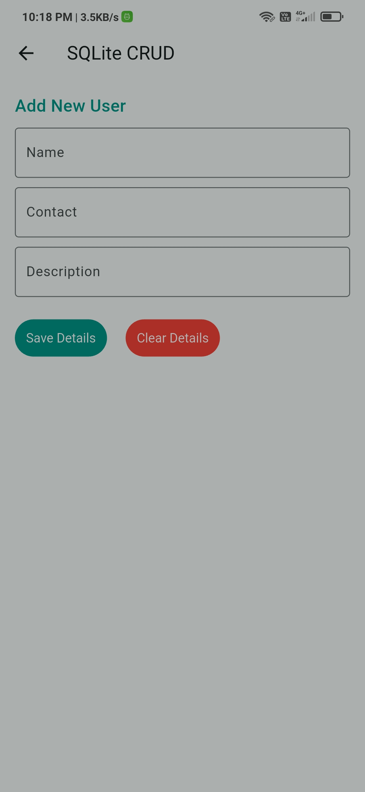
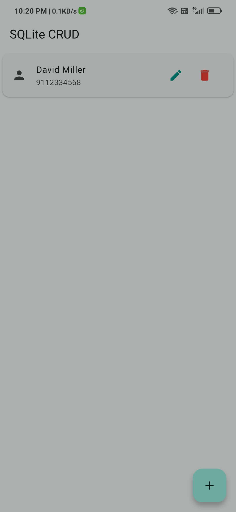

# Flutter SQLite CRUD App

A simple Flutter application to perform CRUD (Create, Read, Update, Delete) operations using SQLite Database.

This project demonstrates how to handle local data storage in Flutter using SQLite with a clean architecture approach.

---

## Features 🚀

- Add New User
- View All Users
- View User Details
- Update User Information
- Delete User
- SQLite Database Integration
- Asynchronous Programming using Future
- Structured & Clean Code

---

## Screenshots 📱

_Add screenshots after pushing the project_

| Add User | View Users | User Details |
|----------|------------|--------------|
|  |  |  |

---

## Packages Used 🧩

| Package         | Usage                                |
|-----------------|-------------------------------------|
| sqflite         | For SQLite database operations     |
| path            | To manage file paths               |
| path_provider   | To get device directory paths      |

---
